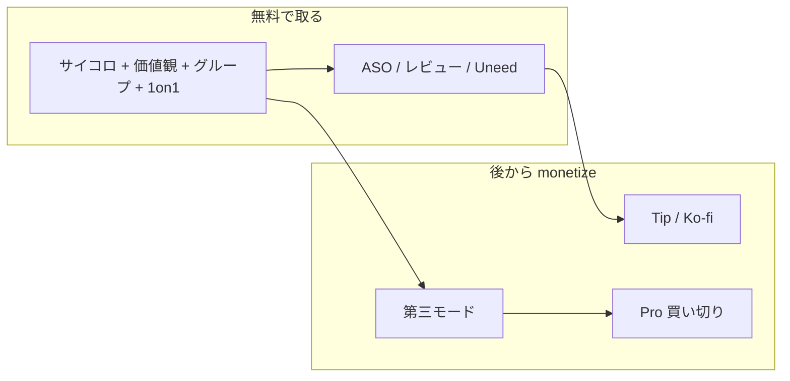

# Talk Shuffle マネタイズ方針（改訂 2026-06）

> **チェックイン/チェックアウト機能は中止**（2026-06）。`data/checkin_checkout_work.json` にデータのみ残存。マネタイズ・マーケの対象外。

## 結論（先に）

**収益の主役は「1on1 デッキの有料化」ではない。**

無料側（価値観カード 26枚 + グループディスカッション 約120問 + サイコロ）の方が **量・汎用性ともに厚い**。1on1（約22問）だけ Pro にすると「小さな隠しデッキの有料化」に見え、**意味がユーザーに伝わらない**。

**採用方針:**

| 層 | 内容 | 目的 |
| --- | --- | --- |
| **無料コア** | サイコロ + 価値観 + グループ + **1on1** | DL・口コミ・ASO（1on1 キーワード） |
| **Tip（任意・先に）** | Ko-fi 等 | コード最小の薄い収益 + social proof |
| **Pro（後から）** | **第三モード**（マッシュアップ or ビンゴ）+ 将来エクスポート等 | 体験が別物の paywall。説明可能 |
| **広告** | 非推奨 | 会議 UX とプライバシー訴求と矛盾 |

収益期待値は引き続き **月数千〜1万円台**（ポートフォリオ主目的なら十分）。「稼ぐ」より **設計判断の実績** を優先。

---

## 旧案から変えた理由

### 却下: 「1on1 だけ Pro」

| 問題 | 詳細 |
| --- | --- |
| 価値の逆転 | 無料120問 vs 有料22問 — ユーザー感覚と矛盾 |
| 説明不能 | 「なぜ1on1だけ有料？」にストア文面だけでは答えにくい |
| 実装都合 | `visibleDecks` で非表示にしていたものを Pro 化 — **価値階段ではない** |
| 転換率低 | 非表示のままでは Pro の中身を体験できない |

### 採用: 「厚い方を無料のフック、Pro は差別化モード」

[memo.md](memo.md) の通り、第三の柱（ビンゴ・マッシュアップ）は **ルール付き体験** で Party Qs 等と被りにくい。**こちらを Pro の目玉**にする方が、買う理由とポートフォリオの説明が両立する。

---

## いまのプロダクト資産

Talk Shuffle は **会議・チーム向けトーク支援**（3D サイコロ + カードデッキ）。現状 **課金・広告なし**。

### 無料コア（公開すべき中身）

| デッキ | 規模 | 強み |
| --- | --- | --- |
| 価値観カード | 26枚 + 捨てて並べるルール | チームビルディング定番。ito/Yappi 系の遊び |
| グループディスカッション | 12カテゴリ × 各10問 ≒ 120問 | 研修・勉強会・雑談。アプリの核 |
| 1on1 / 自己内省 | 3セクション × 各6〜8問 ≒ 22問 | 成長対話。ASO・Uneed 訴求向き |
| 3D サイコロ | カスタムテーマ可 | 入口・軽い利用 |

```629:632:lib/models/card_deck.dart
  /// 初回リリースで表示するデッキ（1on1は非表示）
  static List<CardDeck> get visibleDecks => allDecks
      .where((d) => d.type != CardDeckType.oneOnOne)
      .toList();
```

**Phase 0 で `oneOnOne` を visibleDecks に戻す** — マーケ（Solomaker 等）と実体験のギャップを解消する。

### Pro 候補（第三モード完成後）

- **トピック・マッシュアップ**（掛け算プロンプト）— 訴求強、実装コスト中
- **会話ビンゴ** — Jam Bingo との差別化、SNS 映え

※ グループの「カテゴリ追加だけ」は差別化弱。Pro の主役にしない。

---

## なぜ「カテゴリ追加」や「広告」は優先しないか

**カテゴリ追加:** 無料に足すと ARPU 0。有料だけ増やすとニッチで月数百円レベル。リリースネタ・ポートフォリオ向き。

**広告:** ファシリテーション中の UX 破壊 + eCPM 低 + [web/privacy.html](web/privacy.html) のオフライン訴求と矛盾。MAU 1万+ まで非推奨。

---

## 推奨ロードマップ



### Phase 0 — 整合（コード小・最優先）

1. **1on1 をアプリに表示** — `visibleDecks` から `oneOnOne` フィルタを外す
2. **マーケ文面を無料コアに合わせる** — Solomaker / landing / ストア説明。「Pro で1on1」は書かない
3. **レビュー促進** — [review_prompt_service.dart](lib/services/review_prompt_service.dart)（3セッション後）

### Phase 1 — Tip（コードほぼゼロ）

[web/support.html](web/support.html) または landing に **Ko-fi / Buy Me a Coffee**。

- 収益は小さいが **「支援してくれた人」= social proof**
- IAP 実装前の **誠実な第一歩**（Solomaker 向け）

### Phase 2 — 第三モード（認知 + Pro の種）

[memo.md](memo.md) から **1本だけ** 選んで実装:

1. **マッシュアップ**（推奨候補）— かけアイ型、仕事・雑談両方
2. **会話ビンゴ** — ルール付き、Jam Bingo との差

リリースのたび Solomaker / Uneed / X で再投稿 → ポートフォリオ更新。

**初期は無料で出して反応を見る** 選択肢もあり。転換が見えてから Pro 化してもよい。

### Phase 3 — Pro 買い切り（第三モード完成後）

**Talk Shuffle Pro**（目安 ¥480〜980）:


| 無料 | Pro |
| --- | --- |
| サイコロ + カスタムテーマ | 同上 |
| 価値観 + グループ全カテゴリ + 1on1 | 同上 |
| — | **第三モード（マッシュアップ or ビンゴ）** |
| セッション履歴（端末内） | 将来: エクスポート等 |

**実装:** `in_app_purchase` + `PurchaseService` + モード解錠フラグ + [privacy.html](web/privacy.html) 更新。

**ストア説明の一行:** 「会話のお題は無料。Pro はルール付きの新モード（ビンゴ等）を追加。」

**なぜ subscription より買い切り:** ソロ開発・ニッチ市場。解約対応不要。

---

## 宣伝チャネル


| チャネル | 刺さるメッセージ | 導線 |
| --- | --- | --- |
| **Solomaker** | 3D・オフライン・無料コアの設計 | Tip / 将来 Pro の開発ストーリー |
| **Uneed** | 「会議が沈黙する」「1on1の最初の5分」 | **無料で全部試せる** → 気に入ったら Tip or Pro |
| **App Store** | チームビルディング, 1on1, 価値観 | 無料コアの SS。Pro は第三モード SS |
| **Product Hunt** | v2 第三モードリリース時 | optional supporter tier |

**重要:** 「無料で十分使える + 支援したい人向け」が Solomaker では誠実。**強い paywall は逆効果**。

---

## やらないこと（現フェーズ）

- 1on1 だけ Pro にする（価値階段として説明不能）
- 無料コアを削って Pro に回す（既存ユーザー・レビューリスク）
- AdMob を会議 UX に入れる
- 月額サブスクを最初から
- 第三モードなしで IAP だけ先に出す（Pro の中身が弱い）
- マーケとアプリ実体の不一致を放置

---

## 成功指標


| 指標 | 3ヶ月目安 |
| --- | --- |
| App Store レビュー数 | 10件+ |
| 1on1 デッキ利用（履歴 or セッション種別） | 計測開始 |
| Tip / Pro | 月数件でも OK（ポートフォリオ目的） |
| 第三モード | 1本リリース |
| ポートフォリオ | ケーススタudy 1本（Freemium 設計の判断を書く） |

収益期待値: Tip + Pro 合計 **月数千〜1.3万円**。主目的は **設計・判断・リリースの実績**。

---

## 次のアクション

1. **Phase 0** — `oneOnOne` を visibleDecks に戻す + マーケ文面更新（[card_deck.dart](lib/models/card_deck.dart), [mode_selection_page.dart](lib/pages/mode_selection_page.dart), store_assets, [web/landing.html](web/landing.html)）
2. **Phase 1** — Ko-fi リンク（[web/support.html](web/support.html)）
3. **Phase 2** — [memo.md](memo.md) から第三モード1案（推奨: マッシュアップ or ビンゴ）
4. **Phase 3** — 第三モード完成後に IAP + Pro 解錠
